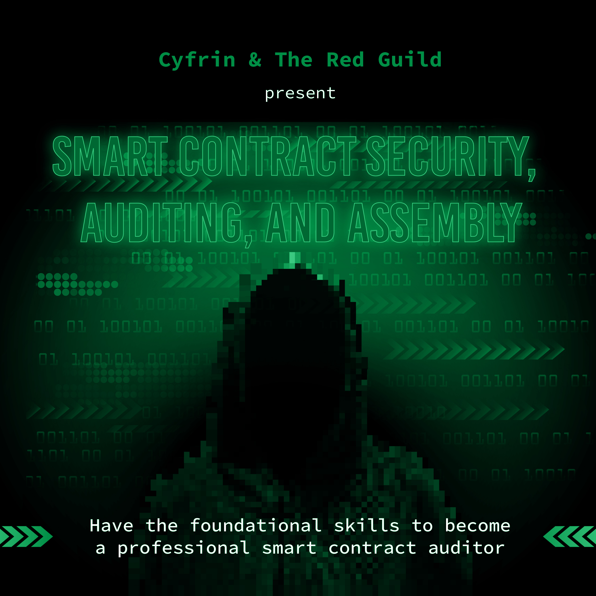
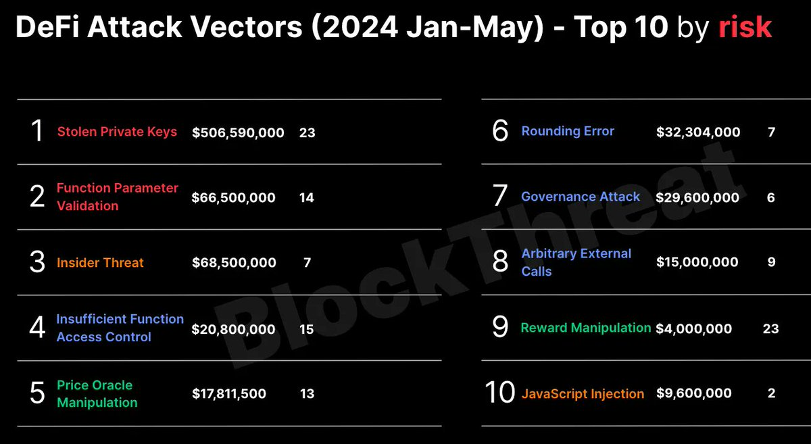
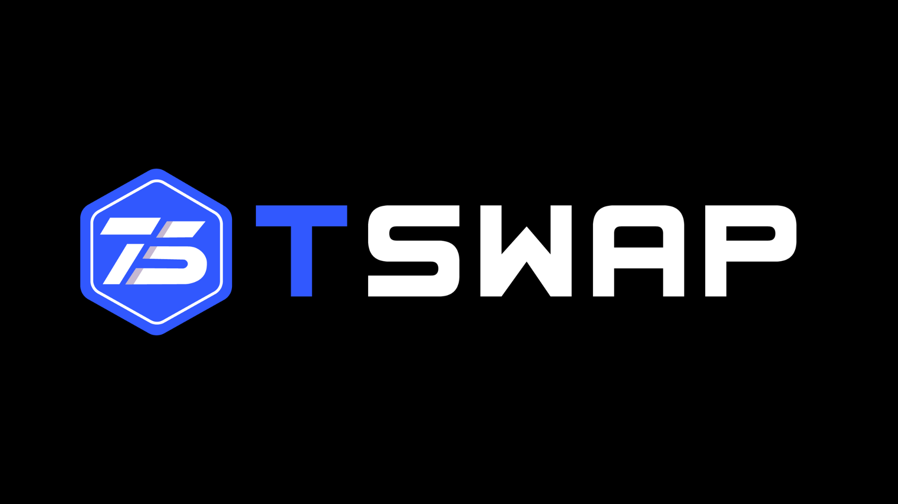
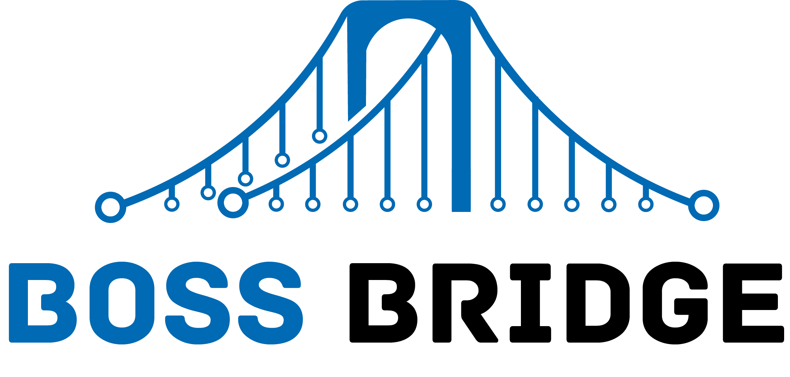
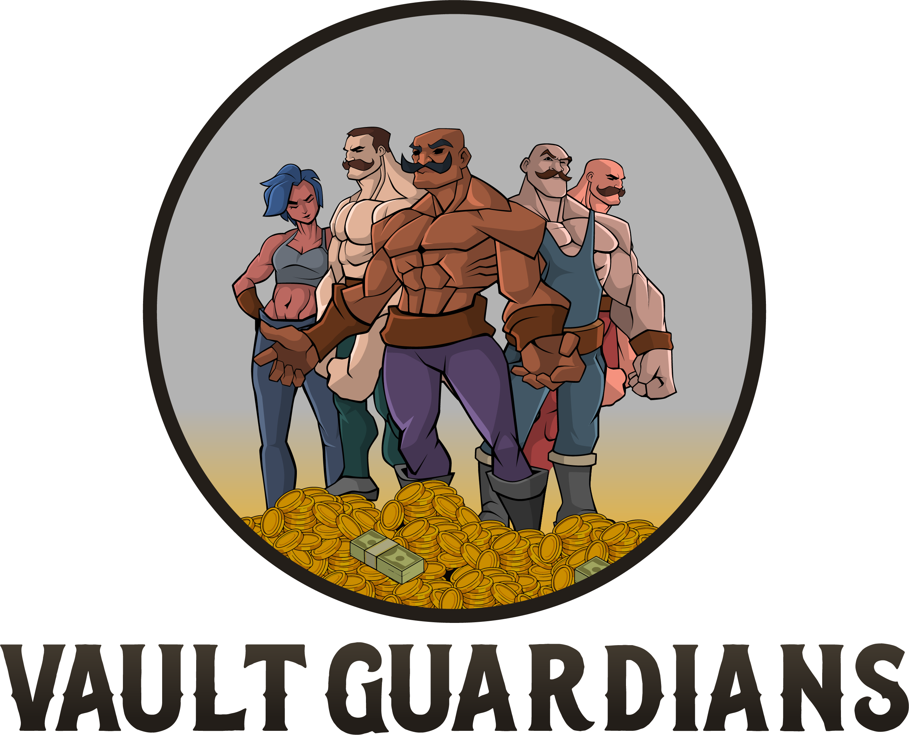

[contributors-shield]: https://img.shields.io/github/contributors/cyfrin/security-and-auditing-full-course-s23.svg?style=for-the-badge
[contributors-url]: https://github.com/cyfrin/security-and-auditing-full-course-s23/graphs/contributors
[forks-shield]: https://img.shields.io/github/forks/cyfrin/security-and-auditing-full-course-s23.svg?style=for-the-badge
[forks-url]: https://github.com/cyfrin/security-and-auditing-full-course-s23/network/members
[stars-shield]: https://img.shields.io/github/stars/cyfrin/security-and-auditing-full-course-s23.svg?style=for-the-badge
[stars-url]: https://github.com/cyfrin/security-and-auditing-full-course-s23/stargazers
[issues-shield]: https://img.shields.io/github/issues/cyfrin/security-and-auditing-full-course-s23.svg?style=for-the-badge
[issues-url]: https://github.com/cyfrin/security-and-auditing-full-course-s23/issues
[license-shield]: https://img.shields.io/github/license/cyfrin/security-and-auditing-full-course-s23.svg?style=for-the-badge
[license-url]: https://github.com/cyfrin/security-and-auditing-full-course-s23/blob/master/LICENSE.txt
[linkedin-shield]: https://img.shields.io/badge/-LinkedIn-black.svg?style=for-the-badge&logo=linkedin&colorB=555

<h1 align="center"> Curso Definitivo de Auditoria, Assembly, Segurança e DeFi em Smart Contracts
 </h1>

<p align="center"><strong> Eleve sua carreira como auditor de smart contracts escrevendo contratos seguros e otimizados.
</strong></p>

<div align="center">

[![Stargazers][stars-shield]][stars-url] [![Forks][forks-shield]][forks-url]
[![Contributors][contributors-shield]][contributors-url]
[![Issues][issues-shield]][issues-url]
[![MIT License][license-shield]][license-url]

<p align="center">
    <br />
    <a href="https://cyfrin.io/">
        </a>
<a href="https://updraft.cyfrin.io/courses/security">
        </a>
    <br />
</p>

E [The Red Guild](https://theredguild.org/)

</div>

Bem-vindo ao repositório do Curso Definitivo de Auditoria, Assembly, Segurança e DeFi em Smart Contracts da Cyfrin Updraft e The Red Guild!

> [IMPORTANTE!]
> Link do Curso: https://updraft.cyfrin.io/courses/security

Este repositório contém o conteúdo escrito dos nossos cursos, organizado para facilitar o acesso e contribuição da nossa comunidade.
Por favor, consulte isto para uma explicação detalhada do conteúdo:

- [Website](https://updraft.cyfrin.io/) - Junte-se à Cyfrin Updraft e aproveite mais de 50 horas de cursos de desenvolvimento de smart contracts
- [Twitter](https://twitter.com/cyfrinupdraft) - Fique atualizado com os últimos lançamentos de cursos
- [LinkedIn](https://www.linkedin.com/school/cyfrin-updraft/) - Adicione a Updraft às suas experiências de aprendizado
- [Discord](http://discord.gg/cyfrin) - Junte-se a uma comunidade de mais de 3000 desenvolvedores e auditores
- [Newsletter](https://www.cyfrin.io/newsletter) - Dicas e recursos semanais de pesquisa em segurança para elevar sua carreira
- [Codehawks](https://www.codehawks.com/) - Competições de auditoria de smart contracts para ajudar a proteger a web3

</br>

<br/>
<p align="center">
<a href="https://updraft.cyfrin.io/" target="_blank">

</a>
</p>
<br/>

# Sumário

_Nota: Se você está familiarizado com os cursos anteriores do Patrick, renomeamos "Lessons" para "Sections"_

## Curso Definitivo de Auditoria, Assembly, Segurança e DeFi em Smart Contracts

<details>
<summary>Curso Definitivo de Auditoria, Assembly, Segurança e DeFi em Smart Contracts</summary>
<ol>
<li><a href="#smart-contract-auditing-assembly-security-and-defi-ultimate-course">Curso Definitivo de Auditoria, Assembly, Segurança e DeFi em Smart Contracts</a></li>
</ol>
</details>
<details>
<summary>Sumário</summary>
<ol>
<li><a href="#table-of-contents">Sumário</a></li>
</ol>
</details>
<details>
<summary>Introdução, Recursos e Pré-requisitos</summary>
<ol>
<li><a href="#resources-for-this-course">Recursos Para Este Curso</a></li>
<li><a href="#prerequisites">Pré-requisitos</a></li>
<li><a href="#outcome">Resultado</a></li>
<li><a href="#bonus-nfts">NFTs Bônus</a>
  <ul>
    <li><a href="#important-notes-for-zksync">Notas Importantes para zkSync</a></li>
    <li><a href="#bridging-to-zksync">Fazendo Bridge para zkSync</a></li>
  </ul>
</li>
</ol>
</details>
<details>
<summary><a href="#curriculum">Grade Curricular</a></summary>
<ol>
<li><a href="#curriculum">Grade Curricular</a></li>
</ol>
</details>
<details>
<summary><a href="#-section-0-welcome-to-the-course">🤗 Seção 0: Bem-vindo ao Curso</a></summary>
<ol>
<li><a href="#welcome">Bem-vindo</a></li>
<li><a href="#why-security">Por que Segurança?</a></li>
<li><a href="#why-web3-is-so-important">Por que Web3 é tão importante</a></li>
<li><a href="#the-final-boss-codebase-youll-be-able-to-audit-this-at-the-end-of-this-course">O Código do Chefe Final, você será capaz de auditá-lo ao final deste curso</a></li>
<li><a href="#best-practices-for-this-course">Melhores Práticas para este curso</a></li>
<li><a href="#section-0-nft">NFT da Seção 0</a></li>
</ol>
</details>
<details>
<summary><a href="#-section-1-review-dont-skip">🐸 Seção 1: Revisão (Não pule)</a></summary>
<ol>
<li><a href="#section-1-nft">NFT da Seção 1</a></li>
</ol>
</details>
<details>
<summary><a href="#-section-2-what-is-a-smart-contract-audit-security-review">❓ Seção 2: O que é uma auditoria de smart contract (Revisão de Segurança)?</a></summary>
<ol>
<li><a href="#what-is-a-security-reviewsmart-contract-audit">O que é uma revisão de segurança/auditoria de smart contract?</a></li>
<li><a href="#smart-contract-development-life-cycle">Ciclo de Vida do Desenvolvimento de Smart Contract</a></li>
<li><a href="#top-smart-contract-auditors-subjective">Principais Auditores de Smart Contract (Subjetivo!)</a></li>
<li><a href="#tooling">Ferramentas</a></li>
<li><a href="#audit-readiness">Preparação para Auditoria</a></li>
<li><a href="#attacker-vs-defender-mindset">Mentalidade de Atacante vs. Defensor</a></li>
<li><a href="#top-attack-vectors">Principais Vetores de Ataque</a></li>
<li><a href="#section-2-nft">NFT da Seção 2</a></li>
</ol>
</details>
<details>
<summary><a href="#️-section-3-your-first-audit-security-review--passwordstore-audit">⛳️ Seção 3: Sua primeira auditoria | Auditoria PasswordStore</a></summary>
<ol>
<li><a href="#security-review--audit">Revisão de Segurança > Auditoria</a></li>
<li><a href="#the-tincho">"O Tincho"</a></li>
<li><a href="#exploits">Exploits</a></li>
<li><a href="#exploits-access-controls">Exploits: Controles de Acesso</a></li>
<li><a href="#writing-your-first-finding">Escrevendo seu primeiro achado</a></li>
<li><a href="#exploits-private-data">Exploits: Dados Privados</a></li>
<li><a href="#your-first-report">Seu primeiro relatório</a></li>
<li><a href="#section-3-nft">NFT da Seção 3</a></li>
</ol>
</details>
<details>
<summary><a href="#-section-4-manual--static-analysis--puppy-raffle-audit">🐶 Seção 4: Análise Manual & Estática | Auditoria Puppy Raffle</summary>
<ol>
<li><a href="#tooling-static-analysis">Ferramentas: Análise Estática</a></li>
<li><a href="#scoping--reconnaissance-puppy-raffle">Escopo & Reconhecimento: Puppy Raffle</a></li>
<li><a href="#exploits-reentrancy">Exploits: Reentrância</a></li>
<li><a href="#exploits-weak-rng">Exploits: RNG Fraco</a></li>
<li><a href="#exploits-arithmetic-issues">Exploits: Problemas Aritméticos</a></li>
<li><a href="#exploits-dos-denial-of-service">Exploits: DoS (Negação de serviço)</a></li>
<li><a href="#exploits-poor-eth-handling">Exploits: Manipulação Inadequada de ETH</a></li>
<li><a href="#informational-findings">Achados Informativos</a></li>
<li><a href="#gas-audits">Auditorias de Gas</a></li>
<li><a href="#code-maturity">Maturidade do Código</a></li>
<li><a href="#writing-the-report-puppy-raffle">Escrevendo o relatório: Puppy Raffle</a></li>
<li><a href="#section-4-nft">NFT da Seção 4</a></li>
</ol>
</details>
<details>
<summary><a href="#-section-5-invariants--intro-to-defi--tswap-audit">🔄 Seção 5: Invariantes & Introdução ao DeFi | Auditoria TSwap</a></summary>
<ol>
<li><a href="#scoping--reconnaissance-t-swap">Escopo & Reconhecimento: T-Swap</a></li>
<li><a href="#intro-to-defionchain-finance">Introdução ao DeFi/Finanças OnChain</a></li>
<li><a href="#tooling-t-swap">Ferramentas: T-Swap</a></li>
<li><a href="#exploits-weird-erc20s">Exploits: ERC20s Estranhos</a></li>
<li><a href="#exploits-core-invariant-breaking">Exploits: Quebra de Invariante Principal</a></li>
<li><a href="#design-patterns-t-swap">Padrões de Design: T-Swap</a></li>
<li><a href="#section-5-nft">NFT da Seção 5</a></li>
</ol>
</details>
<details>
<summary><a href="#️-section-6-centralization-proxies-and-oracles--thunder-loan-audit">🌩️ Seção 6: Centralização, Proxies e Oráculos | Auditoria Thunder Loan</a></summary>
<ol>
<li><a href="#️-section-6-centralization-proxies-and-oracles--thunder-loan-audit">Seção 6: Centralização, Proxies e Oráculos | Auditoria Thunder Loan</a></li>
<li><a href="#scoping--reconnaissance-thunder-loan">Escopo & Reconhecimento: Thunder Loan</a>
  <ul>
    <li><a href="#defi-borrowing--lending">DeFi: Empréstimo & Empréstimo</a></li>
    <li><a href="#malicious-scope">Escopo Malicioso</a></li>
  </ul>
</li>
<li><a href="#tooling-thunder-loan">Ferramentas: Thunder Loan</a>
  <ul>
    <li><a href="#exploits-failure-to-initialize">Exploits: Falha na inicialização</a></li>
    <li><a href="#exploits-storage-collision">Exploits: Colisão de armazenamento</a></li>
    <li><a href="#exploits-centralization">Exploits: Centralização</a></li>
    <li><a href="#exploits-missing-events">Exploits: Eventos ausentes</a></li>
    <li><a href="#exploits-bad-upgrade">Exploits: Atualização ruim</a></li>
    <li><a href="#exploits-oracle--price-manipulation">Exploits: Manipulação de Oráculo & Preço</a></li>
  </ul>
</li>
<li><a href="#design-patterns-thunder-loan">Padrões de Design: Thunder Loan</a></li>
<li><a href="#section-6-nft">NFT da Seção 6</a></li>
</ol>
</details>
<details>
<summary><a href="#-section-7-bridges-chains-signatures-intro-to-yulassembly--bridge-boss-audit">🌉 Seção 7: Bridges, Chains, Assinaturas, Introdução ao Yul/Assembly | Auditoria Bridge Boss</a></summary>
<ol>
<li><a href="#-section-7-bridges-chains-signatures-intro-to-yulassembly--bridge-boss-audit">Seção 7: Bridges, Chains, Assinaturas, Introdução ao Yul/Assembly | Auditoria Bridge Boss</a></li>
<li><a href="#tooling-boss-bridge">Ferramentas: Boss Bridge</a></li>
<li><a href="#scoping--reconnaissance-boss-bridge">Escopo & Reconhecimento: Boss Bridge</a>
  <ul>
    <li><a href="#exploits-opcode-support">Exploits: Suporte a Opcode</a></li>
    <li><a href="#exploits-signature-replay">Exploits: Replay de Assinatura</a></li>
    <li><a href="#exploits-erc20-contract-approval">Exploits: Aprovação de Contrato ERC20</a></li>
    <li><a href="#exploits-unlimited-minting">Exploits: Mintagem Ilimitada</a></li>
  </ul>
</li>
<li><a href="#bridge-hacks">Hacks de Bridge</a>
  <ul>
    <li><a href="#writing-the-report-boss-bridge">Escrevendo o relatório: Boss Bridge</a></li>
  </ul>
</li>
<li><a href="#design-patterns-boss-bridge">Padrões de Design: Boss Bridge</a></li>
<li><a href="#section-7-nft">NFT da Seção 7</a></li>
</ol>
</details>
<details>
<summary><a href="#section-8-the-final-boss-audit-mev-nodes--daos--vault-guardians-audit">🛡️ Seção 8: (A AUDITORIA DO CHEFE FINAL) MEV, Nodes & DAOs | Auditoria Vault Guardians</a></summary>
<ol>
<li><a href="#section-8-the-final-boss-audit-mev-nodes--daos--vault-guardians-audit">Seção 8: (A AUDITORIA DO CHEFE FINAL) MEV, Nodes & DAOs | Auditoria Vault Guardians</a></li>
<li><a href="#concepts-vault-guardians">Conceitos: Vault Guardians</a>
  <ul>
    <li><a href="#exploits-governance-attack">Exploits: Ataque de Governança</a></li>
    <li><a href="#exploits-blocktimestamp-can-be-bad">Exploits: `block.timestamp` pode ser ruim</a></li>
  </ul>
</li>
<li><a href="#introduction-to-mev">Introdução ao MEV</a>
  <ul>
    <li><a href="#exploits-slippage-protection">Exploits: Proteção contra Slippage</a></li>
  </ul>
</li>
<li><a href="#design-patterns-vault-guardians">Padrões de Design: Vault Guardians</a></li>
<li><a href="#section-8-nft">NFT da Seção 8</a></li>
</ol>
</details>
<details>
<summary>Primeira Auditoria Competitiva CodeHawks</summary>
<ol>
<li><a href="#first-codehawks-competitive-audit">Primeira Auditoria Competitiva CodeHawks</a></li>
</ol>
</details>

<details>
<summary>Parabéns</summary>
<ol>
<li><a href="#congratulations">Parabéns</a></li>
<li><a href="#where-do-i-go-now">Para onde vou agora?</a></li>
<li><a href="#learning-more">Aprendendo Mais</a></li>
</ol>
</details>
<details>
<summary>Obrigado</summary>
<ol>
<li><a href="#thank-you">Obrigado</a></li>
<li><a href="#sponsors">Patrocinadores</a></li>
<li><a href="#lead-lecturers--code-builders">Professores Principais / Construtores de Código</a></li>
<li><a href="#guest-lecturers">Professores Convidados</a></li>
<li><a href="#special-thanks">Agradecimentos Especiais</a></li>
<li><a href="#more-security-stuff">Mais Conteúdo de Segurança</a></li>
<li><a href="#huge-extra-thank-you">Enorme Agradecimento Extra</a></li>
</ol>
</details>

# Introdução, Recursos e Pré-requisitos

Acesse o site [Cyfrin Updraft](https://updraft.cyfrin.io/) para ter a melhor experiência de aprendizado!

Link para o curso: https://updraft.cyfrin.io/courses/security

> ⚠️ Todo o código associado a este curso é apenas para fins de demonstração. Eles foram auditados, mas não os recomendamos para uso em produção e devem ser usados por sua própria conta e risco.

## Recursos Para Este Curso

Junte-se ao [Cyfrin Updraft](https://updraft.cyfrin.io/) para a melhor experiência de aprendizado!

- Amigos IA
  - [ChatGPT](https://chat.openai.com/)
    - Apenas saiba que frequentemente ele cometerá erros, mas é muito rápido!
  - [Phind](https://www.phind.com/)
    - Como o ChatGPT, mas pesquisa na web
  - [Bard](https://bard.google.com/)
  - [Outras extensões de IA](https://twitter.com/aisolopreneur/status/1654823630155464704?s=42&t=-pu_sCYtfrfPJU7OXfifrQ)
- Discussões do Github
  - Faça perguntas e converse sobre o curso aqui!
- [Stack Exchange Ethereum](https://ethereum.stackexchange.com/)
  - Ótimo lugar para fazer perguntas técnicas sobre Ethereum
- [Peeranha](https://peeranha.io/)
  - Stack Exchange Descentralizado!
- [Cookbook](./cookbook-listings.md)
  - Um registro de smart contracts e co-piloto

### Recursos de Exploit

- [SC Exploits Minimized](https://github.com/Cyfrin/sc-exploits-minimized)

### Registro de Contratos de Desafio

- [Contratos de Desafio (zkSync)](https://explorer.zksync.io/address/0x176bB45B13AA90D2CD313d526F14a2F4C6583495)
- [Contratos de Desafio (zkSync Sepolia)](https://sepolia.explorer.zksync.io/address/0x9F2099521c7116E251d3847837d22EC7D172f04B)
- [Contratos de Desafio (Sepolia)](https://sepolia.etherscan.io/token/0x31801c3e09708549c1b2c9e1cfbf001399a1b9fa#code)

## Pré-requisitos

Um entendimento intermediário de solidity. Você não precisa ser um profissional, mas deve estar familiarizado com:

- Fundamentos de blockchain (transações, blocos, descentralização, etc)
- Executando uma suíte de testes de smart contract (hardhat, foundry, truffle, etc)
- Fundamentos de Solidity (variáveis, funções, structs, etc)

Aqui estão alguns recursos para você se atualizar com os pré-requisitos:

- [Curso Completo de Foundry](https://www.youtube.com/watch?v=umepbfKp5rI): Isso lhe dará todos os pré-requisitos
- [Speed Run Ethereum](https://speedrunethereum.com/): Isso lhe dará a maior parte do que você precisa. Mas você precisará de um pouco mais de tempo em testes invariantes, usando foundry e DeFi/Finanças OnChain.

### Ferramentas de pré-requisito

- [git](https://git-scm.com/book/en/v2/Getting-Started-Installing-Git)
- [foundry](https://getfoundry.sh/)
- [VSCode ou outro editor de texto](https://code.visualstudio.com/)
- [Entender sintaxe Markdown](https://www.markdownguide.org/basic-syntax/)
- [ChatGPT ou outro assistente de IA](https://chat.openai.com/chat)

## Resultado

- Ter as habilidades fundamentais para se tornar um auditor profissional de smart contracts
- Falar, interagir e contribuir com a comunidade de segurança web3
- Competir em auditorias competitivas web3
- Competir em bug bounties web3
- Iniciar uma carreira como auditor independente
- Se tornar um desenvolvedor de smart contracts top 1%

## NFTs Bônus

- [Você pode encontrá-los no zkSync aqui](https://explorer.zksync.io/address/0x176bB45B13AA90D2CD313d526F14a2F4C6583495)
- São apenas números de 0 -> 8

### Notas Importantes para zkSync

SE VOCÊ DECIDIR MINTAR O NFT REAL:

1. Não auditamos/revisamos a segurança do NFT, então se você quiser ter certeza de que estará seguro, interaja com o contrato usando uma carteira descartável (uma carteira com muito pouco dinheiro que você não usa para mais nada)
   1. Na verdade... Acostume-se a interagir com carteiras a partir de uma carteira descartável
2. Leia minha [thread no Twitter sobre segurança básica de carteira](https://twitter.com/PatrickAlphaC/status/1663936101650685954)

### Fazendo Bridge para zkSync

1. Não mostramos como levar ETH -> zkSync, mas o processo seria:
   1. Comprar ETH (Em uma exchange como [Coinbase](https://www.coinbase.com/home) ou [Kraken](https://www.kraken.com/))
2. Enviar ETH -> uma de suas carteiras como:
   1. [Safe (Multi-Sig)](https://safe.global/)
   2. [Metamask](https://metamask.io/)
   3. [Frame](https://frame.sh/)
   4. [Rainbow](https://rainbow.me/)
   5. [Argent](https://www.argent.xyz/)
   6. [Coinbase Wallet](https://www.coinbase.com/wallet)
3. Usar a [Bridge zkSync](https://portal.zksync.io/bridge/)

# Grade Curricular

# 🤗 Seção 0: Bem-vindo ao Curso

_Não pule esta seção!_

## Bem-vindo

## Por que Segurança Web3?

- Web3 é importante
  - Finanças sem permissão
  - Promessas inquebráveis
- A segurança Web3 está abaixo do ideal agora
  - [Placar Rekt](https://rekt.news/leaderboard/)
  - [$1B em 2023](https://www.theblock.co/post/248550/web3-losses-exceed-1-billion-in-2023-base-exploits) (até agora)
  - Hacks Web3 vs Web2. Web2 é principalmente roubo de PII, onde hacks Web3 resultam em perdas irrevogáveis de fundos.
  - Atores maliciosos no espaço. Hackers solitários vs. atores estatais persistentes bem financiados (por exemplo, Coreia do Norte).
- Oportunidades de carreira
  - Desenvolvedor Top 1%
  - Auditorias Privadas
    - [Cyfrin](https://www.cyfrin.io/)
    - [Trail Of Bits](https://www.trailofbits.com/)
    - [Pesquisador de Segurança Independente](https://www.codehawks.com/leaderboard)
  - Auditorias Competitivas
    - [CodeHawks](https://www.codehawks.com/)
    - [Code4rena](https://code4rena.com/)
  - Bug Bounties
    - [$2.2M de Pagamento](https://www.youtube.com/watch?v=sgHHbWvWj9A)
    - [Immunefi](https://immunefi.com/)
    - [Hats Finance](https://hats.finance/)
  - Futuro:
    - Respondedores a Incidentes
    - Investigadores on-chain
    - Mais…

## Por que Web3 é tão importante

- Reconstruir a confiança no ecossistema.
- Imagem de Faroeste para os outsiders

- [Escolha uma classe](https://github.com/devtooligan/etherrealms-player-class-guide)

## O Código do Chefe Final, você será capaz de auditá-lo ao final deste curso

- [Vault Guardians](https://github.com/Cyfrin/8-vault-guardians-audit)

## Melhores Práticas para este curso

- Registre-se no [Cyfrin Updraft](https://updraft.cyfrin.io/)
  - USE ESTE SITE!!! Foi feito especificamente para facilitar o aprendizado
- **Siga o repositório:** Durante o curso, certifique-se 100% de seguir junto com o repositório github. Se você encontrar algum problema, verifique as atualizações cronológicas no repositório.
- **Seja Ativo na comunidade:** Faça perguntas e interaja com outros desenvolvedores que estão fazendo o curso na aba de discussões, certifique-se de ir lá e dizer olá ou gm! Este espaço é diferente das outras indústrias, você não precisa ser secretivo; comunique-se, faça networking e aprenda com os outros :)
- **Aprenda no seu próprio ritmo:** Não importa se leva um dia, uma semana, um mês ou até um ano. Progresso >>> Perfeição
- **Faça Pausas:** Você vai esgotar sua mente e lembrar menos se assistir todo o curso de uma vez.
  **Estratégia Sugerida** a cada 25 minutos faça uma pausa de 5 minutos, e a cada 2 horas faça uma pausa mais longa de 30 minutos
- **Consulte a Documentação:** As coisas estão constantemente sendo atualizadas, então sempre que Patrick abrir alguma documentação, abra do seu lado e talvez até tenha o exemplo de código ao seu lado.
- **Use ChatGPT e/ou o chat do curso**

E finalmente, ao embarcar nesta jornada, você agora é um "Pesquisador de Segurança", não um "Auditor". A palavra-chave é "Pesquisador", então vamos passar por estratégias para aprendizado contínuo para que você possa se manter no topo do seu jogo.

🎯🎯🎯🎯🎯🎯🎯🎯🎯🎯🎯🎯🎯🎯🎯🎯🎯🎯🎯🎯🎯🎯🎯

## Melhores Práticas para este curso

- Registre-se no [Cyfrin Updraft](https://updraft.cyfrin.io/)
  - USE ESTE SITE!!! Foi feito especificamente para facilitar o aprendizado
- **Siga o repositório:** Durante o curso, certifique-se 100% de seguir junto com o repositório github. Se você encontrar algum problema, verifique as atualizações cronológicas no repositório.
- **Seja Ativo na comunidade:** Faça perguntas e interaja com outros desenvolvedores que estão fazendo o curso na aba de discussões, certifique-se de ir lá e dizer olá ou gm! Este espaço é diferente das outras indústrias, você não precisa ser secretivo; comunique-se, faça networking e aprenda com os outros :)
- **Aprenda no seu próprio ritmo:** Não importa se leva um dia, uma semana, um mês ou até um ano. Progresso >>> Perfeição
- **Faça Pausas:** Você vai esgotar sua mente e lembrar menos se assistir todo o curso de uma vez.
  **Estratégia Sugerida** a cada 25 minutos faça uma pausa de 5 minutos, e a cada 2 horas faça uma pausa mais longa de 30 minutos
- **Consulte a Documentação:** As coisas estão constantemente sendo atualizadas, então sempre que Patrick abrir alguma documentação, abra do seu lado e talvez até tenha o exemplo de código ao seu lado.
- **Use ChatGPT e/ou o chat do curso**

E finalmente, ao embarcar nesta jornada, você agora é um "Pesquisador de Segurança", não um "Auditor". A palavra-chave é "Pesquisador", então vamos passar por estratégias para aprendizado contínuo para que você possa se manter no topo do seu jogo.

🎯🎯🎯🎯🎯🎯🎯🎯🎯🎯🎯🎯🎯🎯🎯🎯🎯🎯🎯🎯🎯🎯🎯

🎯 Exercício: Escreva uma mensagem para _você mesmo_ sobre por que você quer isso

- Isso será importante quando as coisas ficarem difíceis
- É dinheiro? Salvar a web3? Se tornar alguém? Escreva quantas razões possíveis.

### NFT da Seção 0

- [Bem-vindo! (zkSync)](https://explorer.zksync.io/address/0x096f1835070EfCC3C53FFBA41C23cfD087e85b51)
- [Bem-vindo! (Sepolia)](https://sepolia.etherscan.io/address/0x39338138414df90ec67dc2ee046ab78bcd4f56d9)

🎯🎯🎯🎯🎯🎯🎯🎯🎯🎯🎯🎯🎯🎯🎯🎯🎯🎯🎯🎯🎯🎯🎯

<p align="right">(<a href="#table-of-contents">voltar ao topo</a>) ⬆️</p>

# 🐸 Seção 1: Revisão (Não pule)

## Pré-requisitos de Ferramentas & Ambiente

- VSCode
- VSCodium
- [Foundry](https://book.getfoundry.sh/)
  - chisel
  - cast
  - forge
- [Usuários Windows: WSL](https://learn.microsoft.com/en-us/windows/wsl/install)
- Assistentes de IA
  - ChatGPT
  - Phind
- Fóruns & Recursos
  - Ethereum Stack Exchange
  - Peeranha
  - Discussões do Github

## Pré-requisitos de Solidity & Smart Contracts

- [Remix](https://remix.ethereum.org/)
- Contratos inteligentes básicos
  - `forge init`

## Fuzzing & Fuzzing Stateful (Isso pode ser novo)

- Testes de Fuzzing
- Fuzzing Stateless
- Fuzzing Stateful
- Invariantes
  - [Vídeo](https://www.youtube.com/watch?v=juyY-CTolac)

## EIPs/ERCs Comuns

- Github Copilot
- ERC20s
  - [Vídeo](https://www.youtube.com/watch?v=8rpir_ZSK1g)
- NFTs (ERC721s)
  - [Vídeo](https://www.youtube.com/watch?v=9yuHz6g_P50)

## Solidity Avançado

- storage
  - Clipe do curso foundry
- Fallback & Receive
- Encoding, Call, & Staticcall
  - Clipe do curso completo foundry
  - [Encoding.sol](https://github.com/Cyfrin/foundry-nft-f23/blob/main/src/sublesson/Encoding.sol)
  - [CallAnything.sol](https://github.com/Cyfrin/foundry-nft-f23/blob/main/src/sublesson/CallAnything.sol)
- Delegatecall & Proxies
  - Clipe do curso completo foundry
- tx.origin vs msg.sender
- Selfdestruct (será removido em um fork futuro)
  - [Solidity by example](https://solidity-by-example.org/hacks/self-destruct/)

## Foundry Avançado

- mainnet-forking

🐸🐸🐸🐸🐸🐸🐸🐸🐸🐸🐸🐸🐸🐸🐸🐸🐸🐸🐸🐸🐸🐸🐸

🐸 Exercício:

1. Entre no [Discord CodeHawks/Cyfrin](https://discord.gg/cyfrin)
2. Vá dar uma caminhada e prepare-se

### NFT da Seção 1

- [NFT Refresher Fresh (zkSync)](https://arbiscan.io/address/0x7a0f40757f6ba868b44ce959a1d4b8bc22c21d59)
- [NFT Refresher Fresh (Sepolia)](https://sepolia.etherscan.io/address/0x76d2403b80591d5f6af2b468bc14205fa5452ac0)

🐸🐸🐸🐸🐸🐸🐸🐸🐸🐸🐸🐸🐸🐸🐸🐸🐸🐸🐸🐸🐸🐸🐸

<p align="right">(<a href="#table-of-contents">voltar ao topo</a>) ⬆️</p>

# ❓ Seção 2: O que é uma auditoria de smart contract (Revisão de Segurança)?

## O que é uma revisão de segurança/auditoria de smart contract?

- [Visão Geral](https://www.youtube.com/watch?v=aOqhQvWhUG0)
- As pessoas dizem "auditoria" -> revisão de segurança
- Não existe bala de prata para auditoria, e elas têm limitações
- 3 fases de uma revisão de segurança
  - Revisão Inicial
    - 0. Escopo
    - 1. Reconhecimento
    - 2. Identificação de vulnerabilidades
    - 3. Relatório
  - Correções do Protocolo
    - 1. Corrige problemas
    - 2. Retesta e adiciona testes
  - Revisão de Mitigação
    - 1. Reconhecimento
    - 2. Identificação de vulnerabilidades
    - 3. Relatório

## [Ciclo de Vida do Desenvolvimento de Smart Contract](https://aws.amazon.com/what-is/sdlc/)

- Planejar & Projetar
- Desenvolver & Testar
- Auditoria de Smart Contract & Planejamento Pós-Implantação
  - [Isso é apenas uma etapa?](https://aws.amazon.com/what-is/sdlc/)
- Implantar
- Monitorar & Manter

## [Principais Auditores de Smart Contract (Subjetivo!)](https://patrickalphac.medium.com/top-7-smart-contract-auditors-bec7bd70dd9f)

- Use esta lista para referência de como as principais equipes de segurança fazem revisões, publicam relatórios, fazem pesquisas, etc

## Preparação para Auditoria

- [Lista de Verificação de Segurança Simples](https://github.com/nascentxyz/simple-security-toolkit)
  - Suite de testes com cobertura de código
  - Fuzzing, Análise Estática
  - Natspec (especialmente para funções externas/públicas)
- [O Teste Rekt](https://blog.trailofbits.com/2023/08/14/can-you-pass-the-rekt-test/)
  - "Maturidade do código" é importante!

## Ferramentas

- Análise Estática
  - Slither
  - Aderyn
- Testes de Fuzzing / Invariantes
  - Foundry
  - Echidna
  - Consensys
- Verificação Formal
  - Certora
  - Solidity SMT Checker
  - Maat
  - Manticore
- IA
- [Ferramentas vs Humanos](https://github.com/ZhangZhuoSJTU/Web3Bugs)

## Mentalidade de Atacante vs. Defensor

- Aprendendo sempre

## Principais Vetores de Ataque

- Principais vetores de ataque

<br/>
<p align="center">
<a href="https://updraft.cyfrin.io/" target="_blank">

</a>
</p>
<br/>

📝📝📝📝📝📝📝📝📝📝📝📝📝📝📝📝📝📝📝📝📝📝📝

📝 Exercício: Inscreva-se em uma newsletter de segurança/web3!

- [Cyfrin Updraft](https://updraft.cyfrin.io/)
- [Blockchain Threat Intelligence](https://newsletter.blockthreat.io?r=2mgsm7) (Link de indicação)
- [Solodit (não é uma newsletter, mas tem atualizações constantes de novos hacks)](https://solodit.xyz/)
- [rekt](https://rekt.news/)
- [Week In Ethereum](https://weekinethereumnews.com/)
- [Consensys Diligence Newsletter](https://consensys.io/diligence/newsletter/)
- [Officer CIA](https://officercia.mirror.xyz/)

### NFT da Seção 2

- [O mais difícil de todo o curso (zkSync)](https://explorer.zksync.io/address/0xc8B948a7fF5FBfC4b7334fF7628973aefC469A9d)
- [O mais difícil de todo o curso (Sepolia)](https://sepolia.etherscan.io/address/0x34d130b174f4a30a846fed7c02fcf53a19a4c2b6)

📝📝📝📝📝📝📝📝📝📝📝📝📝📝📝📝📝📝📝📝📝📝📝

<p align="right">(<a href="#table-of-contents">voltar ao topo</a>) ⬆️</p>
🟢🟢🟢🟢🟢🟢🟢🟢🟢🟢🟢🟢🟢🟢🟢🟢🟢🟢🟢🟢🟢🟢🟢

_Nota Importante:_ Agora vamos fazer auditorias. Por favor, note que não encontraremos todos os bugs em cada base de código. Cada base de código foi projetada para mostrar um conjunto específico de bugs e dar a você uma boa compreensão de como uma auditoria "se parece".

🟢🟢🟢🟢🟢🟢🟢🟢🟢🟢🟢🟢🟢🟢🟢🟢🟢🟢🟢🟢🟢🟢🟢

# ⛳️ Seção 3: Sua primeira auditoria (revisão de segurança) | Auditoria PasswordStore

<br/>
<p align="center">
<a href="https://updraft.cyfrin.io/" target="_blank">

</a>
</p>
<br/>

💻 Código da Revisão de Segurança V1: [https://sepolia.etherscan.io/address/0x2ecf6ad327776bf966893c96efb24c9747f6694b](https://sepolia.etherscan.io/address/0x2ecf6ad327776bf966893c96efb24c9747f6694b)

💻 Código da Revisão de Segurança V2: [https://github.com/Cyfrin/3-passwordstore-audit](https://github.com/Cyfrin/3-passwordstore-audit)

💻 Código da Revisão de Segurança V3: [https://github.com/Cyfrin/3-passwordstore-audit/tree/onboarded](https://github.com/Cyfrin/3-passwordstore-audit/tree/onboarded)

💻 Revisão de Segurança Final: https://github.com/Cyfrin/3-passwordstore-audit/tree/audit-data

Sinta-se à vontade para olhar adiante e tentar encontrar os bugs na base de código por conta própria, ou familiarizar-se primeiro com o protocolo.

Lembre-se das fases!

🔽🔽🔽🔽🔽🔽🔽🔽🔽🔽

- Revisão Inicial
  - 0. Definição de Escopo
  - 1. Reconhecimento
  - 2. Identificação de Vulnerabilidades
  - 3. Relatório

🔼🔼🔼🔼🔼🔼🔼🔼🔼🔼

Para esta demonstração, estamos ignorando as últimas 2 fases

- Correções do Protocolo
  - 1. Corrige problemas
  - 2. Retesta e adiciona testes
- Revisão de Mitigação
  - 1. Reconhecimento
  - 2. Identificação de Vulnerabilidades
  - 3. Relatório

## A Configuração (Definição de Escopo): PasswordStore

## V1

- "Ei, aqui está meu link para o Etherscan, posso receber uma auditoria?"
  - [Guia de listagem de ativos da Coinbase](https://www.coinbase.com/blog/a-guide-to-listing-assets-on-coinbase)

### V2

- Integração com o Cliente: Mínima

### V3

- `cloc`

## "O Método Tincho"

- Ler a documentação
- Fazer anotações no código
- Do menor para o maior
- [Métricas de Solidity](https://github.com/Consensys/solidity-metrics)
- [Revisão ENS do Tincho](https://www.youtube.com/watch?app=desktop&v=A-T9F0anN1E)

## Exploits (Identificação de Vulnerabilidades)

### Exploits: Controles de Acesso

- Falta do `onlyowner`
  - Controles de Acesso
    - Funções sensíveis desprotegidas
    - Má configuração de papéis
    - Escalada de privilégios

### Exploits: Dados Privados

- Armazenando um segredo (dados privados não são privados)

### Mais Reconhecimento

- cobertura

## Escrevendo seu primeiro achado

- Escrever o achado
  - Como escrever um bom achado
  - Título: Causa Raiz + Impacto
  - Layout do Achado:

```
### [S-#] Título (CAUSA RAIZ + IMPACTO)

**Descrição:**

**Impacto:**

**Prova de Conceito:**

**Mitigação Recomendada:**
```

- Escrever PoC
- Mitigação
- Usando IA

## Terminamos?

## Seu primeiro relatório (Relatando)

- Escrevendo o Relatório
  - Classificação de Severidade
    - [Guia de Severidade](https://docs.codehawks.com/hawks-auditors/how-to-evaluate-a-finding-severity)
  - Relatório Básico em Markdown
    - [Modelo](https://github.com/Cyfrin/audit-report-templating)
    - [Forma alternativa de gerar um relatório em PDF](https://github.com/Cyfrin/audit-report-templating/blob/main/README.md#alternative-way-to-generate-a-pdf-audit-report)

🥚🥚🥚🥚🥚🥚🥚🥚🥚🥚🥚🥚🥚🥚🥚🥚🥚🥚🥚🥚🥚🥚🥚

🥚 Exercícios:

1. [Cadastre-se no CodeHawks!](https://www.codehawks.com/)
2. [Tuíte sobre sua primeira auditoria!](https://twitter.com/intent/tweet?text=Acabei%20de%20completar%20minha%20primeira%20auditoria%20do%20%23web3education%20e%20me%20cadastrei%20no%20@codehawks%21)

### NFT da Seção 3

- [Atualização de armazenamento! (zkSync)](https://explorer.zksync.io/address/0xA248D0d263D47f988E7B09962058fDf1407c6F9e)
- [Atualização de armazenamento! (Sepolia)](https://sepolia.etherscan.io/address/0xa2626be06c11211a44fb6ca324a67ebdbcd30b70)

🥚🥚🥚🥚🥚🥚🥚🥚🥚🥚🥚🥚🥚🥚🥚🥚🥚🥚🥚🥚🥚🥚🥚

<p align="right">(<a href="#table-of-contents">voltar ao topo</a>) ⬆️</p>

# 🐶 Seção 4: Análise Manual & Estática | Auditoria Puppy Raffle

✅✅✅✅✅✅✅✅✅✅✅✅✅✅✅✅✅✅✅✅✅✅✅✅✅

_Esta é a **MELHOR** revisão de segurança para novos auditores, certifique-se 100% de prestar atenção nesta seção._

✅✅✅✅✅✅✅✅✅✅✅✅✅✅✅✅✅✅✅✅✅✅✅✅✅

_Esta é a melhor auditoria/revisão de segurança inicial. Há muitos bugs aqui, alguns óbvios, outros não._

<br/>
<p align="center">
<a href="https://updraft.cyfrin.io/" target="_blank">

</a>
</p>
<br/>

💻 Código da Revisão de Segurança: [https://github.com/Cyfrin/4-puppy-raffle-audit](https://github.com/Cyfrin/4-puppy-raffle-audit)

_Conceitos que você aprenderá: Análise estática, Reentrância, RNG fraco, Problemas aritméticos, Como escrever um relatório com aparência profissional._

## Ferramentas: Análise Estática

- [Bugs Web3 máquina vs humano](https://github.com/ZhangZhuoSJTU/Web3Bugs)
- Análise Estática
  - [Slither](https://github.com/crytic/slither)
  - [Aderyn](https://github.com/Cyfrin/aderyn)
- [cloc](https://github.com/AlDanial/cloc)
- [Métricas de Solidity (estimativa de auditoria)](https://github.com/Consensys/solidity-metrics)
- [Desenvolvedor Visual de Solidity](https://marketplace.visualstudio.com/items?itemName=tintinweb.solidity-visual-auditor)

## Escopo & Reconhecimento: Puppy Raffle

### Exploits: DoS (Negação de serviço)

- Correções:
  - Remover loops desnecessários

### Exploits: Reentrância

- [Estudo de Caso: Hack do DAO](https://www.gemini.com/cryptopedia/the-dao-hack-makerdao)
  - [Ainda nos assombra hoje](https://github.com/pcaversaccio/reentrancy-attacks)
- [Exercícios](https://github.com/Cyfrin/sc-exploits-minimized/tree/main/src/reentrancy)
  - [Pesquise "reentrancy" no Solodit](https://solodit.xyz/)
- Prevenção:
  - CEI/CEII (FREI-PI em breve!)
  - Modificadores NonReentrant

### Exploits: RNG Fraco

- [Estudo de Caso: Meebits](https://forum.openzeppelin.com/t/understanding-the-meebits-exploit/8281)
- [Exercícios](https://github.com/Cyfrin/sc-exploits-minimized/tree/main/src/weak-randomness)
  - [Pesquise "RNG" no Solodit](https://solodit.xyz/)
- Prevenção:
  - [Chainlink VRF](https://docs.chain.link/vrf)

### Exploits: Problemas Aritméticos

- Exemplos:
  - Sub/Overflow
  - Arredondamento & Precisão
- [Exercícios](https://github.com/Cyfrin/sc-exploits-minimized/tree/main/src/arithmetic)
  - [Pesquise "overflow" no Solodit](https://solodit.xyz/)
- Prevenção:
  - Use versões mais recentes do solidity
  - Multiplique antes de dividir

### Exploits: Manipulação Inadequada de ETH

- Estudo de caso: [Sushiswap Miso](https://samczsun.com/two-rights-might-make-a-wrong/)
- Exercícios:
  - [ETH preso sem forma de sacar](https://gist.github.com/tinchoabbate/99fbf7cbce47eb7c463212fd13f21149)
  - [Manipulação inadequada de ETH](https://github.com/Cyfrin/sc-exploits-minimized/tree/main/src/mishandling-of-eth)
  - [Pesquise "Stuck ETH" no Solodit](https://solodit.xyz/)

### Achados Informativos

- Versionamento Estrito do Solc
- Ataques à Cadeia de Suprimentos
- Números Mágicos

### Auditorias de Gas

### Maturidade do Código

- Cobertura de código

### Análise Estática, continuação

## O que é uma Auditoria Competitiva?

- [Documentação CodeHawks](https://docs.codehawks.com/)

### Escrevendo o relatório: Puppy Raffle

- [Modelo de Relatório de Auditoria](https://github.com/Cyfrin/audit-report-templating/)
- [Modelo de Relatório Github (Cyfrin)](https://github.com/Cyfrin/audit-repo-cloner)
- [Modelo de Relatório Github (Spearbit)](https://github.com/spearbit-audits/report-generator-template)
- [Modelo de Relatório Github (Spearbit Personalizado)](https://github.com/Cyfrin/report-generator-template)

🧑‍🚀🧑‍🚀🧑‍🚀🧑‍🚀🧑‍🚀🧑‍🚀🧑‍🚀🧑‍🚀🧑‍🚀🧑‍🚀🧑‍🚀🧑‍🚀🧑‍🚀🧑‍🚀🧑‍🚀🧑‍🚀🧑‍🚀🧑‍🚀🧑‍🚀🧑‍🚀🧑‍🚀🧑‍🚀🧑‍🚀

🧑‍🚀 Exercícios:

1. [Desafios Ethernaut](https://ethernaut.openzeppelin.com/) (1, 9 e 10) 🧑‍🚀
2. Cadastre-se no [Solodit](https://solodit.xyz/)
3. [Poste um tweet sobre como você completou a Auditoria Puppy Raffle!](https://twitter.com/intent/tweet?text=Acabei%20de%20completar%20a%20Auditoria%20Puppy%20Raffle%20%F0%9F%90%B6%20do%20%40cyfrinaudits%20do%20Curso%20Ultimate%20de%20Segurança.%0a%0aObrigado%20%40patrickalphac!)
4. [Cadastre-se no farcaster](https://www.farcaster.xyz/)
5. Faça um [CodeHawks First Flight](https://www.codehawks.com/first-flights)

### NFT da Seção 4

- [Um hack combinado (zkSync)](https://explorer.zksync.io/address/0x9cB9C62f4d29C0300655e838831deaDeeb481Baf)
- [Um hack combinado (Sepolia)](https://sepolia.etherscan.io/address/0xf988ebf9d801f4d3595592490d7ff029e438deca)

🧑‍🚀🧑‍🚀🧑‍🚀🧑‍🚀🧑‍🚀🧑‍🚀🧑‍🚀🧑‍🚀🧑‍🚀🧑‍🚀🧑‍🚀🧑‍🚀🧑‍🚀🧑‍🚀🧑‍🚀🧑‍🚀🧑‍🚀🧑‍🚀🧑‍🚀🧑‍🚀🧑‍🚀🧑‍🚀🧑‍🚀

<p align="right">(<a href="#table-of-contents">voltar ao topo</a>) ⬆️</p>

# 🔄 Seção 5: Invariantes & Introdução ao DeFi | Auditoria TSwap

<br/>
<p align="center">
<a href="https://updraft.cyfrin.io/" target="_blank">

</a>
</p>
<br/>

💻 Código da Revisão de Segurança: [https://github.com/Cyfrin/5-t-swap-audit](https://github.com/Cyfrin/5-t-swap-audit)

_Conceitos que você aprenderá: Fuzzing stateful, Fuzzing, Invariantes, FREI-PI/CEII, DeFi Avançado, AMMs, Uniswap, Curve.fi, Fórmula do produto constante_

🛑🛑🛑🛑🛑🛑🛑🛑🛑🛑🛑🛑🛑🛑🛑🛑

PARE!

Não olhe os contratos para este!

Vamos mostrar como você pode usar ferramentas avançadas para encontrar ainda mais bugs apenas entendendo adequadamente os invariantes e escrevendo suítes de teste mais efetivas.

🛑🛑🛑🛑🛑🛑🛑🛑🛑🛑🛑🛑🛑🛑🛑🛑

## A Configuração (Escopo): T-Swap

- Integração com o cliente: Extensiva

## Reconhecimento: T-Swap

- Invariantes do Protocolo
- [FREI-PI/CEI](https://www.nascent.xyz/idea/youre-writing-require-statements-wrong)

### Introdução ao DeFi/Finanças OnChain

- [DeFi Llama](https://defillama.com/)
- [AMMs](https://chain.link/education-hub/what-is-an-automated-market-maker-amm)
- [UniswapV1](https://uniswap.org/)
- [Curve](https://curve.fi/)
- [Fórmula do Produto Constante](https://docs.uniswap.org/contracts/v2/concepts/protocol-overview/how-uniswap-works)

## Ferramentas: T-Swap

- Forge Fuzzing, Fuzzing Stateful, Invariantes
  - [Echidna](https://github.com/crytic/echidna)
  - [Foundry](https://getfoundry.sh/)
  - [Consensys](https://fuzzing.diligence.tools/login)
  - Introdução ao Teste de Mutação
  - Introdução ao Teste Diferencial
- [Solodit](https://solodit.xyz/)
- [Propriedades](https://github.com/crytic/properties)

### Exploits: ERC20s Estranhos

- [Lista de verificação de integração de token](https://secure-contracts.com/development-guidelines/token_integration.html)
- [Lista de ERC20s Estranhos](https://github.com/d-xo/weird-erc20)
- Rebase & taxa-na-transferência
- Callbacks de reentrância ERC777

### Exploits: Quebra de Invariante Principal

- Estudo de Caso:
  - Uniswap
  - [Euler](https://www.youtube.com/watch?v=vleHZqDc48M)

### Padrões de Design: T-Swap

- FREI-PI / CEII / Verificações Pré & Pós

💰💰💰💰💰💰💰💰💰💰💰💰💰💰💰💰💰💰💰💰💰💰💰💰💰💰

💰 Exercícios:

1. Escreva um teste de fuzzing para encontrar um bug neste [desafio](https://gist.github.com/tinchoabbate/67b195b95fe77a5b9e3c6cc4bf80b3f7)
2. Escreva um thread no Twitter sobre um [achado interessante do Solodit](https://solodit.xyz/)

### NFT da Seção 5

- [Um Hack DeFi On-Chain Legítimo (zkSync)](https://explorer.zksync.io/address/0x21dDDcEF5E67EC2EdD9E95A868219C68196bcAD8)
- [Um Hack DeFi On-Chain Legítimo (Sepolia)](https://sepolia.etherscan.io/address/0xdeb8d8efef7049e280af1d5fe3a380f3be93b648)

💰💰💰💰💰💰💰💰💰💰💰💰💰💰💰💰💰💰💰💰💰💰💰💰💰💰

🎊🎊🎊🎊🎊🎊🎊🎊🎊🎊🎊🎊🎊🎊🎊🎊🎊🎊🎊🎊🎊🎊🎊🎊🎊🎊

Parabéns!!

Se você chegou até aqui no curso e entende o que está acontecendo, você tem as habilidades para começar a ser pago como pesquisador de segurança, fazendo auditorias competitivas, caça a bugs, ou até mesmo ser contratado!

Mas se você quer se tornar um dos melhores do mundo e realmente proteger a web3, continue...

🎊🎊🎊🎊🎊🎊🎊🎊🎊🎊🎊🎊🎊🎊🎊🎊🎊🎊🎊🎊🎊🎊🎊🎊🎊🎊

<p align="right">(<a href="#table-of-contents">voltar ao topo</a>) ⬆️</p>

# 🌩️ Seção 6: Centralização, Proxies e Oráculos | Auditoria Thunder Loan

<br/>
<p align="center">
<a href="https://updraft.cyfrin.io/" target="_blank">

</a>
</p>
<br/>

💻 Código da Revisão de Segurança: [https://github.com/Cyfrin/6-thunder-loan-audit](https://github.com/Cyfrin/6-thunder-loan-audit)

_Estamos começando a ficar mais avançados com DeFi e problemas de smart contracts. Aperte os cintos, está esquentando._

## Escopo & Reconhecimento: Thunder Loan

### DeFi: Empréstimo & Empréstimo

- [Aave](https://aave.com/)
- [Compound](https://compound.finance/)
- Oráculos
  - [Chainlink](https://chain.link/)
  - TWAP
- Proxies
  - [UUPS & Transparente](https://docs.openzeppelin.com/contracts/4.x/api/proxy)
  - [Proxy Multi-facetado (Diamond)](https://eips.ethereum.org/EIPS/eip-2535)
  - [Proxies & Upgrades do Foundry](https://github.com/Cyfrin/foundry-upgrades-f23)
  - [O que são smart contracts atualizáveis?](https://www.youtube.com/watch?v=bdXJmWajZRY)
- Centralização

### Escopo Malicioso

- Não seja "yes-man" em toda auditoria

## Ferramentas: Thunder Loan

- [Upgradehub](https://upgradehub.xyz/)
- [**init vs **init_unchained](https://forum.openzeppelin.com/t/difference-between-init-and-init-unchained/25255)

### Exploits: Falha na inicialização

- Estudo de Caso: [Eu acidentalmente matei](https://github.com/openethereum/parity-ethereum/issues/6995)

### Exploits: Colisão de armazenamento

### Exploits: Centralização

- Atualizações Silenciosas
- Estudo de Caso: [Oasis](https://medium.com/@observer1/uk-court-ordered-oasis-to-exploit-own-security-flaw-to-recover-120k-weth-stolen-in-wormhole-hack-fcadc439ca9d)

### Exploits: Eventos ausentes

### Exploits: Atualização ruim

### Exploits: Manipulação de Oráculo & Preço

- [Flash Loans](https://www.youtube.com/watch?v=Aw7yvGFtOvI)
- Estudo de Caso: [Alpha Homora](https://twitter.com/stellaxyz_/status/1360535699368251394)
- Estudo de Caso: [Creme Finance](https://rekt.news/cream-rekt-2/)

## Padrões de Design: Thunder Loan

- Pull sobre push

📦📦📦📦📦📦📦📦📦📦📦📦📦📦📦📦📦📦📦📦📦📦📦📦📦📦

📦 Exercícios:

1. [YAcademy Proxy ](https://proxies.yacademy.dev/)
2. Tuíte sobre como VOCÊ se sente sobre smart contracts atualizáveis

### NFT da Seção 6

- [É um pouco assustador o quão poderoso você se tornou (zkSync)](https://explorer.zksync.io/address/0x84c98b9A74707E116b35d0b3b0C851b96D62647c)
- [É um pouco assustador o quão poderoso você se tornou (Sepolia)](https://sepolia.etherscan.io/address/0xcf4fba490197452bd414e16d563623253efb57d3)

📦📦📦📦📦📦📦📦📦📦📦📦📦📦📦📦📦📦📦📦📦📦📦📦📦📦

<p align="right">(<a href="#table-of-contents">voltar ao topo</a>) ⬆️</p>

# 🌉 Seção 7: Bridges, Chains, Assinaturas, Introdução ao Yul/Assembly | Auditoria Bridge Boss

<br/>
<p align="center">
<a href="https://updraft.cyfrin.io/" target="_blank">

</a>
</p>
<br/>

💻 Código da Revisão de Segurança: [https://github.com/Cyfrin/7-boss-bridge-audit](https://github.com/Cyfrin/7-boss-bridge-audit)

## Ferramentas: Boss Bridge

- IA
- Tenderly
- [evm diff](https://www.evmdiff.com/)
- Vamos aprender "o Hans'"
  - [Checklist](https://github.com/Cyfrin/audit-checklist/tree/main)

## Escopo & Reconhecimento: Boss Bridge

- Precompilados
  - Estudo de Caso: [Polygon](https://youtu.be/QdIG7TfjUiM)
- [Demo de chave pública privada](https://github.com/anders94/public-private-key-demo)
- [Revisão de Codificação & Decodificação](https://github.com/Cyfrin/foundry-nft-f23/blob/main/src/sublesson/CallAnything.sol)

### Exploits: Suporte a Opcode

- Estudo de caso: [zkSync](https://medium.com/coinmonks/gemstoneido-contract-stuck-with-921-eth-an-analysis-of-why-transfer-does-not-work-on-zksync-era-d5a01807227d)

### Exploits: Replay de Assinatura

### Exploits: Aprovação de Contrato ERC20

### Exploits: Mintagem Ilimitada

## Hacks de Bridge

- Hacks de bridge: Ronin, Poly network, Nomad, Wormhole

### Escrevendo o relatório: Boss Bridge

## Padrões de Design: Boss Bridge

- Parada de emergência

💰💰💰💰💰💰💰💰💰💰💰💰💰💰💰💰💰💰💰💰💰💰💰💰💰💰

💰 Exercícios:

1. [Desafios Damn Vulnerable DeFi](https://www.damnvulnerabledefi.xyz/) 1, 2, 4
2. Escreva um thread no Twitter sobre uma [descoberta interessante do Solodit](https://solodit.xyz/)
3. Faça um tweet sobre como você concluiu a auditoria mais difícil até agora!
4. Leia sobre mais ataques históricos:
   1. [Replay de Assinatura](https://solodit.xyz/issues/router-signatures-can-be-replayed-when-executing-messages-on-the-destination-domain-spearbit-connext-pdf)
   2. [Problemas de assinatura da árvore Merkle](https://solodit.xyz/issues/m-14-merkle-tree-related-contracts-vulnerable-to-cross-chain-replay-attacks-code4rena-factorydao-factorydao-contest-git)
   3. [Gasto Duplo Polygon](https://medium.com/immunefi/polygon-double-spend-bug-fix-postmortem-2m-bounty-5a1db09db7f1)
   4. [Hack da Bridge Nomad](https://medium.com/immunefi/hack-analysis-nomad-bridge-august-2022-5aa63d53814a)

### NFT da Seção 7

- [Diga Oi para o Vitalik (zkSync)](https://explorer.zksync.io/address/0x31B827e55DBA91f39581647FA14AD7CC5fc9EDaB)
- [Diga Oi para o Vitalik (Sepolia)](https://sepolia.etherscan.io/address/0x33ee14fb8816c92fe401165330bbe29706942183)

💰💰💰💰💰💰💰💰💰💰💰💰💰💰💰💰💰💰💰💰💰💰💰💰💰💰

<p align="right">(<a href="#table-of-contents">voltar ao topo</a>) ⬆️</p>

# Seção 7.5: MEV & Governança

<br/>
<p align="center">
<a href="https://updraft.cyfrin.io/" target="_blank">

</a>
</p>
<br/>

## Introdução ao MEV

- [MEV Explicado](https://www.youtube.com/watch?v=92bdU5uvsD8)
- [MEV Explicado continuação](https://www.youtube.com/watch?v=MlbtSAntr7c)
- [MEV Tóxico](https://collective.flashbots.net/t/on-the-toxicity-classification-of-mev-transactions/521)
  - Frontrunning (Antecipação)
  - Ataques Sandwich
- não-tóxico
  - Backrunning (Execução posterior)
- Proteção MEV
  - Design
  - [Flashbots Protect](https://docs.flashbots.net/flashbots-protect/overview)
  - [MEVBlocker](https://mevblocker.io/)
  - [Securerpc](https://securerpc.com/)
- MEV em nossas revisões de segurança anteriores:
  - Puppy:
    - Alguém pode fazer frontrun do `selectWinner` para solicitar um reembolso
  - T-Swap:
    - A proteção de prazo significa que as pessoas podem fazer um ataque "sandwich"
  - Thunder Loan:
    - Usuários podem fazer frontrun de empréstimos flash para tornar as taxas mais altas ou mais baixas
  - Boss Bridge:
    - Uma transação assinada pode sofrer frontrun para que um atacante envie tokens de uma L2 antes que o assinante possa
- Proteção contra Slippage

### Exploits: Ataque de Governança

- Mintagem Ilimitada
- Votação com Flash Loan
- Estudo de Caso: [Beanstalk](https://rekt.news/beanstalk-rekt/)
- Atualizações Metamórficas
  - Estudo de Caso: Governança TORN

# 🛡️ Seção 8: (A AUDITORIA DO CHEFE FINAL) MEV, Nós, & DAOs | Auditoria Vault Guardians

<br/>
<p align="center">
<a href="https://updraft.cyfrin.io/" target="_blank">

</a>
</p>
<br/>

_Esta revisão de segurança é opcional. É MUITO código! Mas se você escolher fazê-la, terá uma ideia melhor de como é uma base de código maior. É importante se sentir confortável ao abordar uma base de código e dizer "Eventualmente vou entender esta base de código, mas agora não entendo"!_

💻 Código da Revisão de Segurança: [https://github.com/Cyfrin/8-vault-guardians-audit](https://github.com/Cyfrin/8-vault-guardians-audit)

## Conceitos: Vault Guardians

- [Vaults Tokenizados (ERC-4626)](https://eips.ethereum.org/EIPS/eip-4626)
- [Yearn Finance](https://yearn.fi/)
- [Permit2](https://github.com/Uniswap/permit2)

## Boa sorte :)

🦅🦅🦅🦅🦅🦅🦅🦅🦅🦅🦅🦅🦅🦅🦅🦅🦅🦅🦅🦅🦅🦅🦅🦅🦅🦅

🦅 Exercícios:

1. [1ª Auditoria Competitiva CodeHawks](https://codehawks.com/)
2. Escreva um thread no Twitter sobre um [achado interessante do Solodit](https://solodit.xyz/)
3. Escreva um blog ou tweet sobre sua experiência!
4. Leia [estas dicas](https://github.com/0xJuancito/multichain-auditor) para auditar protocolos multi-chain

### NFT da Seção 8

- [VÁ LÁ E CONQUISTE!!! (zkSync)](https://explorer.zksync.io/address/0xC580F34dafb8Fd324Fa22C3aCABF8cb2090117e2)
- [VÁ LÁ E CONQUISTE!!! (Sepolia)](https://sepolia.etherscan.io/address/0xdf7cdff0c5e85c974d6377244d9a0ceffa2b7a86#code)

🦅🦅🦅🦅🦅🦅🦅🦅🦅🦅🦅🦅🦅🦅🦅🦅🦅🦅🦅🦅🦅🦅🦅🦅🦅🦅

🦅🦅🦅🦅🦅🦅🦅🦅🦅🦅🦅🦅🦅🦅🦅🦅🦅🦅🦅🦅🦅🦅🦅🦅🦅🦅

# Primeira Auditoria Competitiva CodeHawks

- Como submeter um achado
- Como decidir a severidade
- Onde encontrar uma auditoria competitiva

🦅🦅🦅🦅🦅🦅🦅🦅🦅🦅🦅🦅🦅🦅🦅🦅🦅🦅🦅🦅🦅🦅🦅🦅🦅🦅

🦅🦅🦅🦅🦅🦅🦅🦅🦅🦅🦅🦅🦅🦅🦅🦅🦅🦅🦅🦅🦅🦅🦅🦅🦅🦅

<p align="right">(<a href="#table-of-contents">voltar ao topo</a>) ⬆️</p>

🎊🎊🎊🎊🎊🎊🎊🎊🎊🎊🎊🎊🎊🎊🎊🎊🎊🎊🎊🎊🎊🎊🎊🎊🎊🎊
Parabéns!!

Se você chegou até aqui no curso e entende o que está acontecendo, você tem as habilidades para se tornar um dos principais pesquisadores de segurança na web3! Seja como auditor solo, freelancer, auditor competitivo, ou até mesmo ser contratado por uma empresa de primeira linha!

No entanto... se você quer estar na vanguarda e ser capaz de entender cada detalhe da web3, você ainda tem um pouco mais pela frente...

🎊🎊🎊🎊🎊🎊🎊🎊🎊🎊🎊🎊🎊🎊🎊🎊🎊🎊🎊🎊🎊🎊🎊🎊🎊🎊

# A Parte 2 foi movida!

## Atualização sobre Carteiras, Pós-implantação, Opcodes EVM, Assembly e Verificação Formal

As próximas seções (originalmente chamadas apenas de "parte 2") foram movidas para seus próprios cursos!

- Carteiras & Pós-Implantação
  - [Updraft](https://updraft.cyfrin.io/courses/wallet-and-deployment)
  - [GitHub](https://github.com/Cyfrin/evm-wallet-and-post-deployment-course)
- Assembly, Opcodes EVM e Verificação Formal
  - [Updraft](https://updraft.cyfrin.io/courses/formal-verification)
  - [GitHub](https://github.com/Cyfrin/assembly-evm-opcodes-and-formal-verification-course)

## Altamente Recomendado

Nós _altamente_ recomendamos fazer estes dois cursos (linkados acima) para que você possa ter um entendimento completo de tudo relacionado à EVM.

<p align="right">(<a href="#table-of-contents">voltar ao topo</a>) ⬆️</p>

# Parabéns

🎊🎊🎊🎊🎊🎊🎊🎊🎊🎊🎊🎊 Completou O Curso! 🎊🎊🎊🎊🎊🎊🎊🎊🎊🎊🎊🎊

Se você chegou até aqui... uau.

## Para onde vou agora?

- Auditorias Competitivas
  - [CodeHawks](https://codehawks.com)
    - Estamos trabalhando em muitas coisas para conseguir mais negócios para você. Fique ligado...
  - [Code4rena](https://code4rena.com/)
  - [Hats Finance](https://hats.finance/)
- [Discord do CodeHawks](https://discord.gg/cyfrin)
- Comece a divulgar seus serviços
  - Twitter, Farcaster, LinkedIn, etc
  - Blog: Medium, Mirror, etc
- Caça-bugs
  - [Immunefi](https://immunefi.com/)
  - [Hats Finance](https://hats.finance/)

## Aprendendo Mais

- [YouTube do Patrick Collins](https://www.youtube.com/c/patrickcollins)
- [Solodit](https://solodit.xyz/)
- [Block Threat Intelligence](https://newsletter.blockthreat.io?r=2mgsm7) (Link de Indicação)
- [Newsletter Consensys Diligence](https://consensys.io/diligence/newsletter/)
- [YouTube do Owen Thurm](https://www.youtube.com/@0xOwenThurm)
- [JohnnyTime](https://www.youtube.com/@JohnnyTime)
- [YouTube do The Red Guild](https://www.youtube.com/channel/UC7bn5DeABT6zQz-bn6GS1Yw)
- [YouTube do Cyfrin](https://www.youtube.com/@CyfrinAudits)

## Divulgações

A equipe Cyfrin administra o CodeHawks, Cyfrin Updraft e revisões privadas de segurança. Eles são consultores do projeto Peeranha e operam vários nós blockchain como Chainlink & Ethereum. Além disso, são responsáveis pela criação das ferramentas Aderyn e Solodit.

# Obrigado

## Patrocinadores

- [Cyfrin](https://www.cyfrin.io/)
  - [Updraft](https://updraft.cyfrin.io/)
  - [CodeHawks](https://codehawks.com/)
  - [Solodit](https://solodit.xyz/)
- [The Red Guild](https://theredguild.org/)

## Professores Principais / Desenvolvedores do Código

- [Patrick Collins | Cyfrin](https://twitter.com/PatrickAlphaC)
- [Tincho | The Red Guild](https://twitter.com/tinchoabbate)

## Professores Convidados

- [Josselin Feist | Trail of Bits](https://twitter.com/Montyly)
  - [Trail of Bits](https://www.trailofbits.com/)
  - Fuzzing & Verificação Formal
- [Owen | Guardian Audits](https://twitter.com/0xOwenThurm)
  - [Guardian Audits](https://guardianaudits.com/)
  - Negação de Serviço
- [Andy Li | Sigma Prime](https://twitter.com/andyfeili)
  - [Sigma Prime](https://sigmaprime.io/)
  - Aleatoriedade Fraca
- [JohnnyTime | Gingersec](https://twitter.com/RealJohnnyTime)
  - [Gingersec](https://gingersec.xyz/)
  - Ataque de Governança (Específico)
- [Pashov | Pesquisador de Segurança Independente](https://twitter.com/pashovkrum)
  - MEV
- [Juliette | Cyfrin](https://twitter.com/_juliettech)
  - Ataque de Governança (Geral)
- [Alex Roan | Cyfrin](https://twitter.com/alexroan)
  - Fuzzing & Engenharia Inteligente

## Agradecimentos especiais

- [hansfriese](https://twitter.com/hansfriese)
- [carlitox477](https://twitter.com/carlitox477)
- [0Kage](https://twitter.com/hansfriese)
- [giovannidisiena.eth](https://twitter.com/giovannidisiena)
- [Dacian](https://twitter.com/DevDacian)
- [Alex Roan](https://twitter.com/alexroan)
- [Peter Kacherginsky](https://twitter.com/_iphelix)
- [Karma Coma](https://twitter.com/0xkarmacoma)
- [Zach Obront](https://twitter.com/zachobront)
- [Pinata (por hospedar meu conteúdo)](https://app.pinata.cloud)

## Mais Conteúdo de Segurança

- ["Auditoria" de contas próprias](https://securityalliance.notion.site/Telegram-Security-Self-Audit-863507aa2ea84360be8e6f30c61e6b0d)
- [https://scsfg.io/](https://scsfg.io/)
- [https://github.com/OffcierCia/Crypto-OpSec-SelfGuard-RoadMap](https://github.com/OffcierCia/Crypto-OpSec-SelfGuard-RoadMap)
- [https://github.com/transmissions11/solcurity](https://github.com/transmissions11/solcurity)
- [https://github.com/OpenCoreCH/smart-contract-auditing-heuristics](https://github.com/OpenCoreCH/smart-contract-auditing-heuristics)
- [https://secure-contracts.com/](https://secure-contracts.com/)
- [https://github.com/crytic/properties](https://github.com/crytic/properties)

## Patrocinadores

Muito obrigado aos nossos patrocinadores/doadores!!

- [Matter Labs (zkSync)](https://zksync.io/)
- [Arbitrum Foundation](https://arbitrum.foundation/)
- [Chainlink Labs](https://chainlinklabs.com/)
- [Certora](https://www.certora.com/)

## Um ENORME Agradecimento Extra

Obrigado a todos que estão fazendo, participando e trabalhando neste curso. Estes cursos são projetos de paixão que compartilham conhecimento para todos no ecossistema web3.

Vamos evoluir para manter a web3 mais segura, e obrigado novamente por fazer este curso!

[](https://twitter.com/cyfrinaudits)
[](https://www.youtube.com/@CyfrinAudits)

<p align="right">(<a href="#table-of-contents">voltar ao topo</a>) ⬆️</p>
